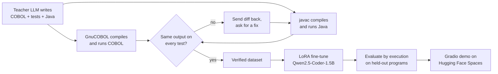

# COBOL → Java: a fine-tuned LLM for legacy code migration

[](https://github.com/DavutKursun/cobol2java/actions/workflows/verify.yml) [](LICENSE)

A small code LLM, fine-tuned with LoRA, that **explains legacy COBOL programs and translates them into equivalent Java 17 code**. Every training example is **execution-verified**: the COBOL and Java programs are compiled and run on the same inputs, and a pair is kept only if their outputs match exactly.

🤗 **Demo:** [Hugging Face Space](https://huggingface.co/spaces/DavutKursun/cobol2java) · **Model:** [DavutKursun/cobol2java-qwen2.5-coder-1.5b](https://huggingface.co/DavutKursun/cobol2java-qwen2.5-coder-1.5b) · **Dataset:** [DavutKursun/cobol-java-verified](https://huggingface.co/datasets/DavutKursun/cobol-java-verified)

<!-- Add a short GIF of the demo here: it is the first thing recruiters look at. -->

## Why

Banks, insurers and public institutions still run critical systems on COBOL, and migrating them to modern stacks is slow, manual work. I took part in such a migration (COBOL → Java Spring Boot, IBM DB2 → PostgreSQL) during an internship. This project explores how much of the translation a small, locally runnable model can do, and measures it by **running the generated code**, not by eyeballing it.

## Results

Held-out test set of N programs, greedy decoding. A program passes only if the Java output matches the COBOL output on **all** of its test inputs.

| Model | Java compiles | pass@1 (all tests) | Test cases passed |
| --- | --- | --- | --- |
| Qwen2.5-Coder-1.5B-Instruct (base) | – | – | – |
| **+ LoRA fine-tune (this project)** | – | – | – |

<!-- Fill in with the tables printed by scripts/evaluate_model.py -->

## How it works



1. **Data generation** (`scripts/generate_pairs.py`): a large open model writes small, realistic COBOL programs (payroll, interest, insurance premiums, tables, string handling…), test inputs and a Java translation.
2. **Verification** (`scripts/verify.py`): both programs are compiled (`cobc`, `javac`) and run; outputs are compared line by line. Failed translations get up to two repair rounds; anything still wrong is discarded.
3. **Fine-tuning** (`scripts/train_lora.py`): LoRA on Qwen2.5-Coder-1.5B-Instruct with TRL, loss on the answer only. Runs on a free Colab T4.
4. **Evaluation** (`scripts/evaluate_model.py`): the model translates unseen programs; the Java is compiled and run against the COBOL original.

The hard part is not syntax but **COBOL semantics**: fixed-size fields, zero padding, edited pictures such as `Z(6)9.99`, truncation versus `ROUNDED`. These are exactly what the execution check catches.

## Repository structure

```
data/programs/<name>/   program.cbl, Main.java, tests.json, explanation.md (one verified pair each)
scripts/verify.py       compile + run + compare COBOL and Java
scripts/generate_pairs.py  generate new verified pairs with a teacher LLM
scripts/build_dataset.py   export train/test JSONL (and push to the Hub)
scripts/train_lora.py      LoRA fine-tuning
scripts/evaluate_model.py  execution-based evaluation
notebooks/train_colab.ipynb  the whole pipeline on Google Colab
space/                  Gradio app for Hugging Face Spaces
```

## Quickstart

```bash
# system tools: GnuCOBOL and a JDK
sudo apt-get install -y gnucobol default-jdk      # macOS: brew install gnucobol && brew install --cask temurin

# macOS (Apple Silicon): let cobc find Homebrew's GMP headers (add to ~/.zshrc)
export CPATH=/opt/homebrew/include LIBRARY_PATH=/opt/homebrew/lib

# local env: only the data pipeline runs locally, training runs on Colab
python3 -m venv .venv && source .venv/bin/activate
pip install openai datasets

python scripts/verify.py data/programs            # check the seed pairs
export HF_TOKEN=hf_...                            # Hugging Face token
python scripts/generate_pairs.py --count 50       # grow the dataset
python scripts/build_dataset.py --reverify
```

Training and evaluation need a GPU: open `notebooks/train_colab.ipynb` in Google Colab.

## Limitations

- Programs are small, self-contained batch programs (stdin → stdout). Real systems add files, VSAM, DB2, CICS and copybooks.
- The target is plain Java; mapping to a Spring Boot service layer is a possible next step.
- Test inputs are finite: passing all tests does not prove equivalence.

No proprietary or client code was used; all programs are synthetic.

## License

Code: [Apache-2.0](LICENSE). The model inherits the license of its base model.
